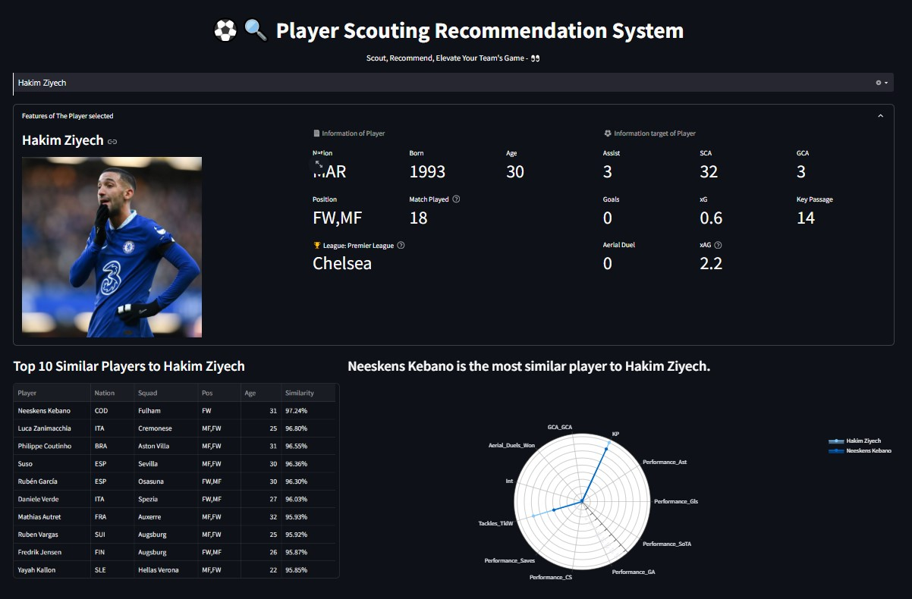

# Player Scouting Recommendation System

## Overview
The **Player Scouting Recommendation System** is designed to recommend football players based on their statistical similarities. Users can input a player's name, and the system will retrieve the top 10 most similar players using cosine similarity based on player statistics. The system uses Apache Solr for data storage and retrieval, while the interface is built with Streamlit.

## Project Structure
/project-root
│── img 
├── app.py                    # Main application file for Streamlit interface
├── docker-compose.yml        # Docker setup for running Solr
├── players.csv               # Dataset containing player statistics
├── README.md                 # Project documentation 
├── requirements.txt          # Python dependencies
└── solr.ipynb                # Jupyter notebook for Solr interaction and queries
## Features
- Search for a player by name.
- Display key statistics for the player such as goals, assists, xG, xA, and more.
- Recommend the top 10 most similar players based on cosine similarity.
- Visual comparison using a radar chart between the selected player and the most similar player.

## Requirements
- **Docker** for running Solr
- **Python 3.7+** with the following libraries:
  - `streamlit`
  - `requests`
  - `pandas`
  - `scikit-learn`

## Setup and Installation
1. **Clone the repository**

    ```bash
    git clone https://github.com/jawadoch/players_recommendation.git
2. **Navigate to the proect directory:**

   ```bash
   cd players_recommendation
3. **Setup Solr using Docker**:

    ```bash
    docker-compose up -d

2. **Install Python dependencies**:

    ```bash
    pip install -r requirements.txt

3. **Run the Streamlit app**:
    ```bash
    streamlit run app.py
## Interface Overview

Below is a visual representation of the **Player Scouting Recommendation System** interface:



In this example, you can see a search for **Hakim Ziyech**, and the system displays his key statistics along with the top 10 most similar players.


## Contributors

- **JAOUAD OUCHBAR** – Data Engineering

